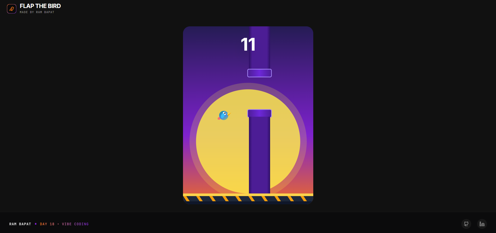
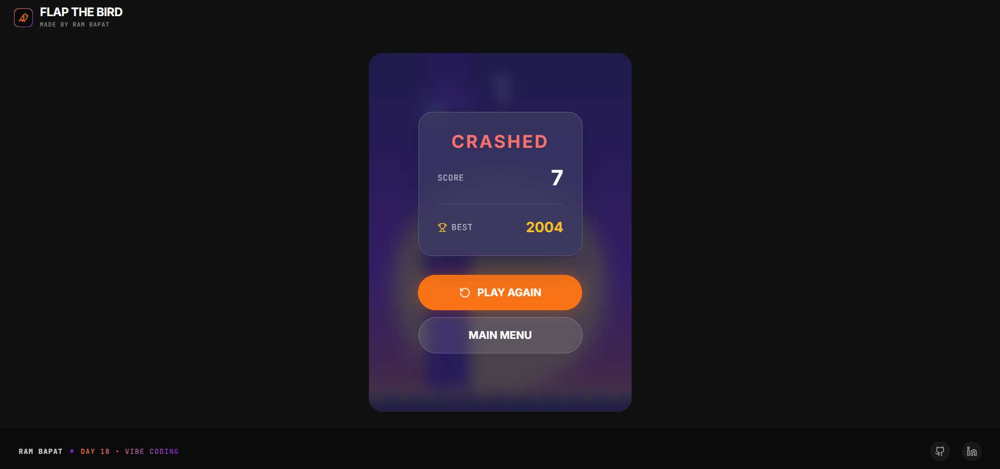

# 🌱 Organic Maths Quiz

    

**Day 19 / 30 - April Vibe Coding Challenge**

## 🔗 [Live Demo](#)

**Organic Maths Quiz** is a premium, ephemeral math mental agility game. Test your memory and calculation skills against the clock in a serene, high-end organic interface. Questions appear for a brief moment before vanishing entirely—force-testing your mental execution.

## 📸 Screenshots






## ✨ Features

*   **⏱️ Ephemeral Questions:** A sequence of 5 progressively difficult quick-math problems is displayed for exactly 2.5 seconds before completely vanishing.
*   **🧩 Instant Visual Feedback:** After choosing an answer, players receive immediate transition feedback via beautifully animated Check or Cross indicators.
*   **🏆 Premium Grading System:** At the end, earn a rank of Gold, Silver, Bronze, or Stone based on the final score. Includes a detailed receipt of exactly what was guessed versus the correct answers.
*   **🎨 High-End Organic Aesthetics:** Designed using a calming color palette of warm linen (`#F4F1EB`), deep forest slate (`#2C302E`), and sage green (`#8B9D83`) paired with Libre Baskerville typography for an elegant academic feel.
*   **🚀 Seamless Animations:** Powered by Framer Motion for buttery-smooth page transitions and pulsing timer indicators.

## 🛠️ Tech Stack

*   **Frontend Framework:** React 19 + Vite
*   **Styling:** Tailwind CSS 4 (Premium Organic Theme)
*   **Animations:** Framer Motion (`motion/react`)
*   **Icons:** Lucide React

## 🚀 Getting Started

### 1. Clone the Repository
```bash
git clone https://github.com/Barrsum/Organic-Maths-Quiz.git
cd Organic-Maths-Quiz
```

### 2. Install Dependencies
```bash
npm install
```

### 3. Run the App
```bash
npm run dev
```

## 👤 Author

**Ram Bapat**
*   [LinkedIn](https://www.linkedin.com/in/ram-bapat-barrsum-diamos)
*   [GitHub](https://github.com/Barrsum)

---
*Part of the April 2026 Vibe Coding Challenge.*
